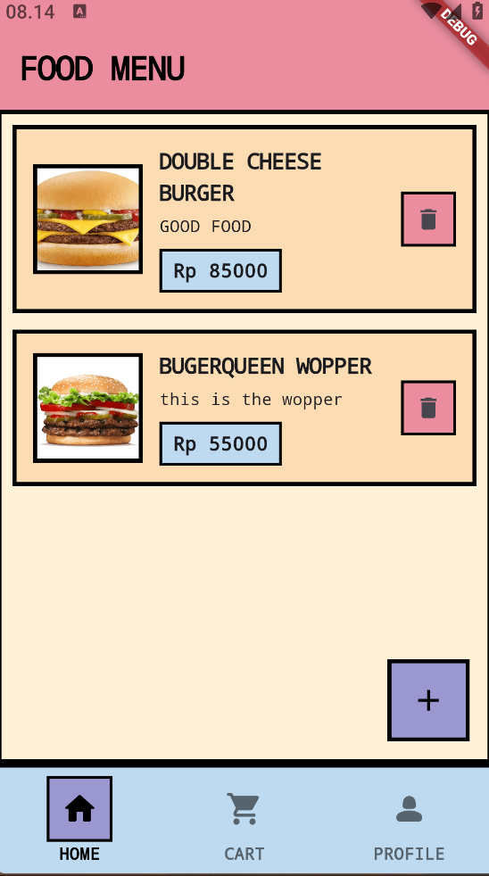
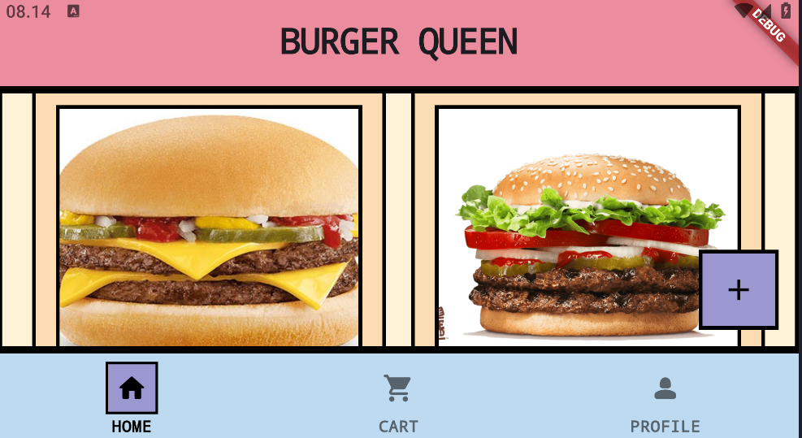
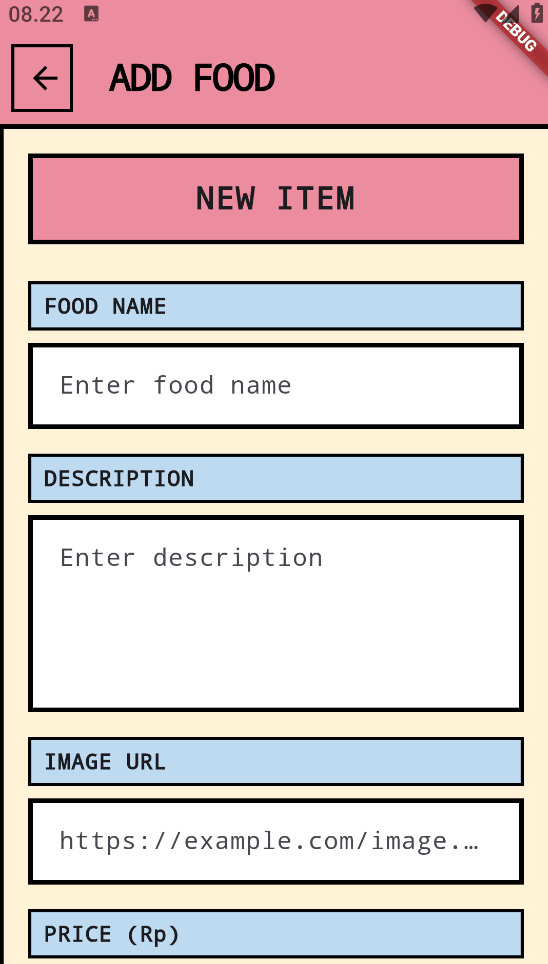
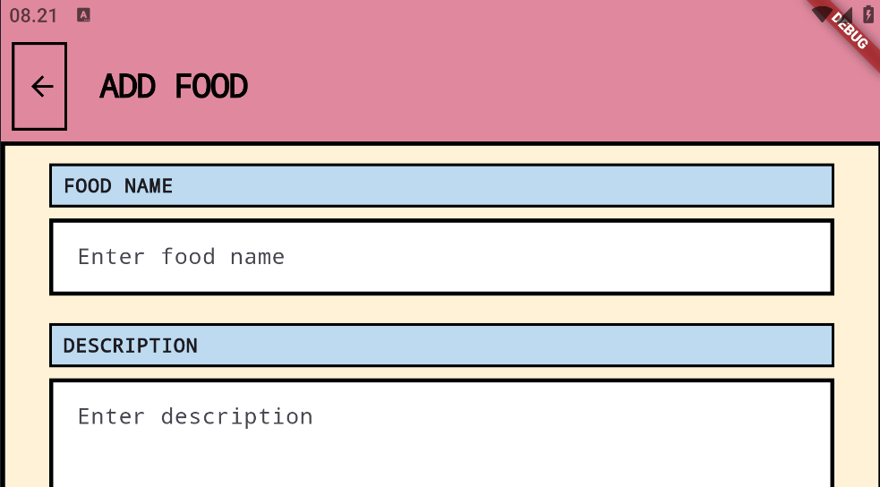
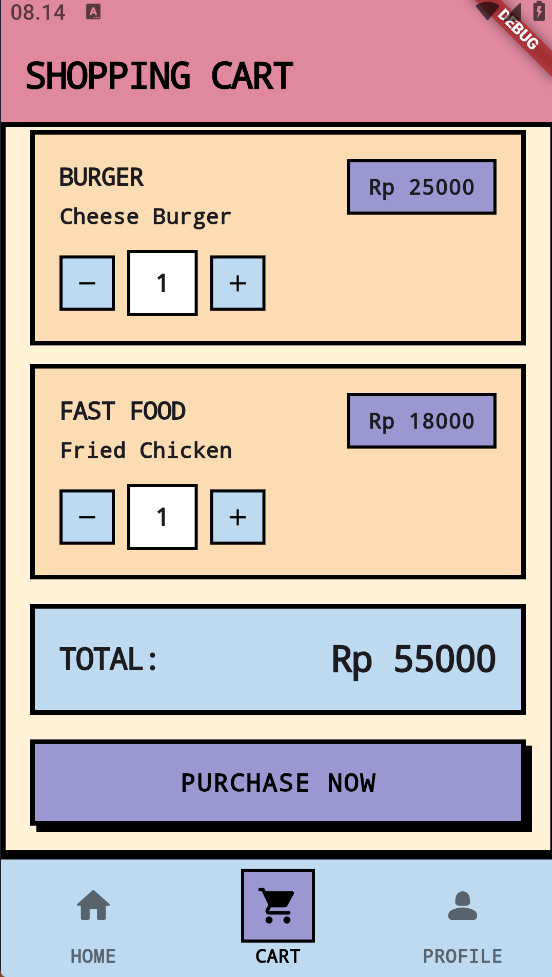
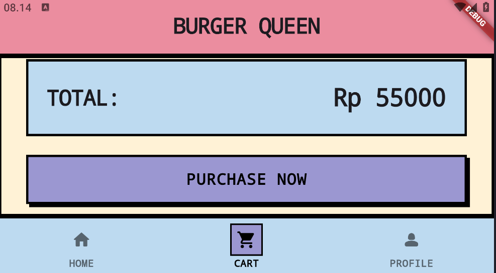
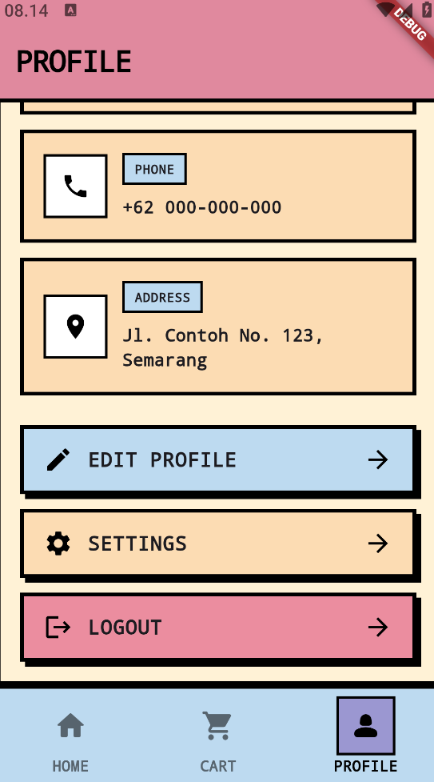
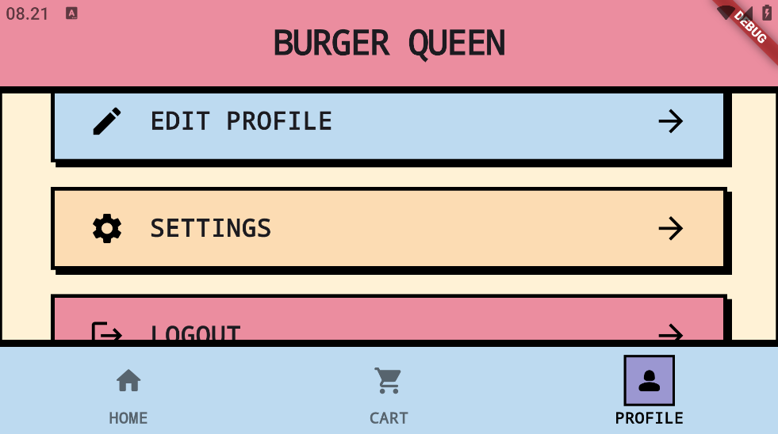
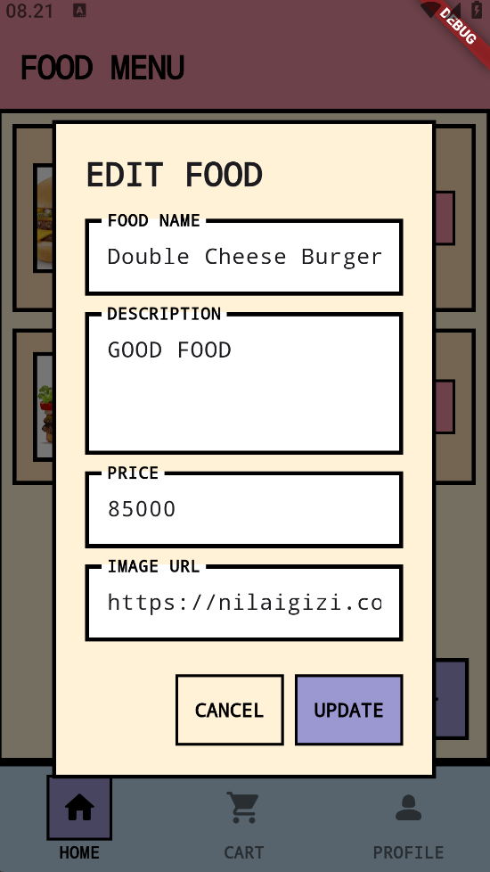

# 🍔 Burger Queen - Dummy Food Ordering App

[](https://flutter.dev)
[](https://firebase.google.com)
[](https://pub.dev/packages/get)

A modern food ordering application built with Flutter, featuring a **Brutalist Design** aesthetic, Firebase integration, and Midtrans payment gateway. The app showcases CRUD operations for food menu management with a bold, no-nonsense UI.

## ✨ Features

- 🎨 **Brutalist Design** - Bold borders, zero rounded corners, high contrast colors
- 🔥 **Firebase Firestore** - Real-time database for food menu
- 💳 **Midtrans Payment** - Integrated payment gateway
- 📱 **Responsive Layout** - Adaptive UI for mobile and tablet using MediaQuery
- 🛒 **Shopping Cart** - Manage your orders before checkout
- 📝 **CRUD Operations** - Add, edit, delete food items
- 🎯 **State Management** - GetX for reactive programming
- 🖼️ **Dynamic Images** - Network image loading with error handling

## 🎨 Design System

### Color Palette
```dart
Primary Background:   #FFF2D6 (Light Yellow)
Card/Surface:         #FCDCB3 (Cream)
AppBar/Accent:        #EB8D9F (Pink)
Bottom Nav/Tags:      #BDDAF0 (Blue)
Primary Action:       #9B97D1 (Purple)
Borders:              #000000 (Black - 3px)
```

### Typography
- **Font Family**: Monospace
- **Weight**: 900 (Black) for headings
- **Weight**: 600-700 for body text
- **Letter Spacing**: -1 to 1 for various elements

## 📸 Screenshot Page Preview

### 🏠 Home Page - Food Menu
<table>
  <tr>
    <td align="center">
      
      <br />
      <em>Mobile View</em>
    </td>
    <td align="center">
      
      <br />
      <em>Tablet View (Grid Layout)</em>
    </td>
  </tr>
</table>

**Features:**
- Real-time food list from Firebase
- Grid layout for tablets (2-3 columns)
- List layout for mobile devices
- Add new food with FAB button
- Edit/Delete food items
- Pull-to-refresh functionality

---

### ➕ Add Food Page
<table>
  <tr>
    <td align="center">
      
      <br />
      <em>Mobile View</em>
    </td>
    <td align="center">
      
      <br />
      <em>Tablet View</em>
    </td>
  </tr>
</table>

**Features:**
- Form with food name, description, image URL, and price
- Brutalist input fields with black borders
- Max width constraint for larger screens
- Custom label components with color coding

---

### 🛒 Shopping Cart
<table>
  <tr>
    <td align="center">
      
      <br />
      <em>Mobile View</em>
    </td>
    <td align="center">
      
      <br />
      <em>Tablet View</em>
    </td>
  </tr>
</table>

**Features:**
- Cart item list with quantity controls
- Price display for each item
- Total calculation with prominent display
- Purchase button with shadow effect
- Responsive card layouts

---

### 💳 Payment Page
<table>
  <tr>
    <td align="center">
      
      <br />
      <em>Loading State</em>
    </td>
    <td align="center">
      
      <br />
      <em>Midtrans WebView</em>
    </td>
  </tr>
</table>

**Features:**
- Midtrans payment integration
- WebView for payment gateway
- Custom loading indicator
- Transaction status handling
- Automatic callback on completion

---

### 👤 Profile Page
<table>
  <tr>
    <td align="center">
      
      <br />
      <em>Mobile View</em>
    </td>
    <td align="center">
      
      <br />
      <em>Tablet View</em>
    </td>
  </tr>
</table>

**Features:**
- User information display
- Info cards with icons
- Action buttons (Edit Profile, Settings, Logout)
- Box shadow effects on interactive elements
- Responsive spacing and sizing

---

### 📝 Edit Food Dialog
<table>
  <tr>
    <td align="center">
      
      <br />
      <em>Edit Food Dialog</em>
    </td>
    <td align="center">
      
      <br />
      <em>Delete Confirmation</em>
    </td>
  </tr>
</table>

**Features:**
- Modal dialog with brutalist styling
- Pre-filled form data
- Update and cancel actions
- Delete confirmation dialog

---

### 🎯 Bottom Navigation
<table>
  <tr>
    <td align="center">
      
      <br />
      <em>Bottom Navigation with Active State</em>
    </td>
  </tr>
</table>

**Features:**
- Three navigation tabs: Home, Cart, Profile
- Active state with border and background
- Fixed to bottom with top border
- Tablet-optimized header banner

## 🛠️ Tech Stack

| Technology | Description |
|-----------|-------------|
| **Flutter** | Cross-platform UI framework |
| **Dart** | Programming language |
| **Firebase** | Backend as a Service (BaaS) |
| **Cloud Firestore** | NoSQL cloud database |
| **GetX** | State management & navigation |
| **Midtrans** | Payment gateway integration |
| **WebView Flutter** | In-app web browser |
| **HTTP** | API communication |

## 📁 Project Structure

```
lib/
├── binding/
│   └── app_binding.dart           # Dependency injection
├── controller/
│   ├── cart_controller.dart       # Cart state management
│   ├── home_controller.dart       # Home page logic
│   ├── mainnav_controller.dart    # Navigation logic
│   └── payment_controller.dart    # Payment handling
├── models/
│   └── food_models.dart           # Food data model
├── page/
│   ├── add_page.dart              # Add food page
│   ├── cart_page.dart             # Shopping cart
│   ├── decrease_page.dart         # Edit food page
│   ├── home_page.dart             # Main food list
│   ├── mainnav_page.dart          # Bottom navigation
│   ├── payment_page.dart          # Payment WebView
│   └── profile_page.dart          # User profile
├── repository/
│   └── food_repository.dart       # Firestore operations
├── routes/
│   ├── pages.dart                 # Route definitions
│   └── routes.dart                # Route constants
├── services/
│   └── payment_service.dart       # Midtrans API service
├── widgets/
│   ├── button_widget.dart         # Custom button
│   ├── cart_widget.dart           # Cart item widget
│   └── food_card.dart             # Food card widget
├── firebase_option.dart           # Firebase configuration
└── main.dart                      # App entry point
```

## 🚀 Getting Started

### Prerequisites

- Flutter SDK (>=3.0.0)
- Dart SDK (>=3.0.0)
- Firebase account
- Midtrans account (for payment)
- Android Studio / VS Code

### Installation

1. **Clone the repository**
```bash
git clone https://github.com/yourusername/burger-queen-app.git
cd burger-queen-app
```

2. **Install dependencies**
```bash
flutter pub get
```

3. **Configure Firebase**
   - Create a new Firebase project
   - Add Android/iOS app to Firebase
   - Download `google-services.json` (Android) or `GoogleService-Info.plist` (iOS)
   - Place in appropriate directories
   - Update `lib/firebase_option.dart` with your credentials

4. **Configure Midtrans**
   - Sign up at [Midtrans](https://midtrans.com)
   - Get your Server Key and Client Key
   - Update payment service configuration

5. **Run the app**
```bash
flutter run
```

## 🔧 Configuration

### Firebase Setup

Update `lib/firebase_option.dart`:

```dart
static const FirebaseOptions android = FirebaseOptions(
  apiKey: 'YOUR_API_KEY',
  appId: 'YOUR_APP_ID',
  messagingSenderId: 'YOUR_MESSAGING_SENDER_ID',
  projectId: 'YOUR_PROJECT_ID',
  storageBucket: 'YOUR_STORAGE_BUCKET',
);
```

### Midtrans Backend

Set up a backend server for Midtrans transactions. Example endpoint:

```javascript
// Node.js Express example
app.post('/create-transaction', async (req, res) => {
  const { order_id, gross_amount, first_name, email } = req.body;
  
  // Call Midtrans Snap API
  const transaction = await midtransClient.createTransaction({
    transaction_details: {
      order_id: order_id,
      gross_amount: gross_amount
    },
    customer_details: {
      first_name: first_name,
      email: email
    }
  });
  
  res.json({ redirect_url: transaction.redirect_url });
});
```

Update base URL in `lib/services/payment_service.dart`:

```dart
static const String baseUrl = 'https://your-backend-url.com';
```

## 📱 Responsive Design

The app uses MediaQuery to detect screen size:

```dart
final screenWidth = MediaQuery.of(context).size.width;
final isTablet = screenWidth > 600;
```

### Breakpoints
- **Mobile**: `< 600px` - List layouts, single column
- **Tablet**: `600px - 900px` - 2 column grid
- **Large Tablet**: `> 900px` - 3 column grid

## 🎯 Key Features Implementation

### CRUD Operations
```dart
// Create
await repository.addFood(foodModel);

// Read (Stream)
Stream<List<FoodModels>> foods = repository.getFood();

// Update
await repository.updateFood(foodModel);

// Delete
await repository.deleteFood(foodId);
```

### State Management with GetX
```dart
// Observable state
final isLoading = true.obs;

// Update state
isLoading.value = false;

// Reactive UI
Obx(() => isLoading.value 
  ? CircularProgressIndicator() 
  : Text('Loaded')
)
```

## 📞 Support

For support, create an issue in this repository.

---

<div align="center">
  <br/>
  <strong>Burger Queen © 2026</strong>
</div>
